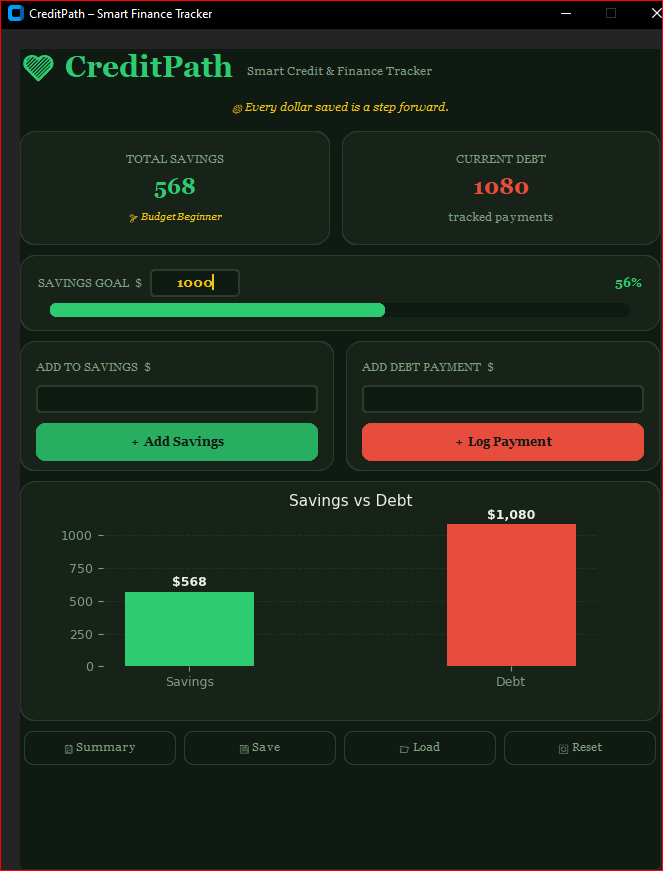

💳 CreditPath – Smart Finance Tracker
📖 Overview

CreditPath is a Python desktop application built using CustomTkinter.
It helps users track savings, debt payments, financial goals, and visualize progress using dynamic charts.

The application demonstrates:

Object-Oriented Programming

Event-Driven GUI Design

Modular Code Structure

Secure Input Validation

Data Visualization with Matplotlib

File Handling with JSON

🛠 Technologies Used

Python 3

CustomTkinter

Matplotlib

JSON (data storage)

🚀 Installation

Clone the repository:

git clone https://github.com/MrsGhost2627/CreditPath.git

Navigate into the project folder:

cd CreditPath

Install dependencies:

pip install -r requirements.txt

Run the program:

python CreditPath.py
🖥 Features

✔ Two Windows (Main + Summary)
✔ Savings and Debt Tracking
✔ Goal Progress Bar
✔ Embedded Chart (Savings vs Debt)
✔ Save & Load Data (JSON files)
✔ Secure Input Validation
✔ Error Handling
✔ Reset Functionality

🔐 Secure Coding Practices

Input validation prevents empty or invalid entries

Exception handling prevents application crashes

File handling includes error catching

User confirmation required before resetting data

🧪 Validation Testing

Test Cases Used:

Valid numeric inputs → Program updates correctly

Empty input → Error message shown

Negative or invalid input → Rejected

Goal reached → Success message displayed

File load with invalid JSON → Error handled

All tests passed successfully after validation improvements.

User Manual

See UserManual.docx for detailed instructions on how to use the application.

👩🏽‍💻 Author

Thaija Wilson
Final Project – Python GUI Development
